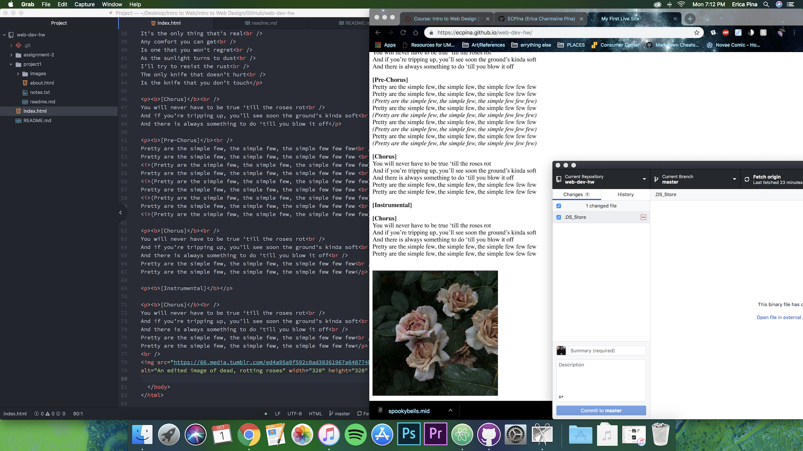

# Project 1 README

### Browsers
I mainly use google chrome and on the rare occasion, safari. Browers basically funtions as a visual translation for written code known as HTML. Within this code, there can be anything from text and links to cascading style sheets and JavaScript functions.

### The Wayback Machine
The Wayback Machine is an interesting website. It allows users to view websites and different times through their history. Essentially, it's an archive. I chose to look at a website I used to visit all the time as a kid called Castle Of Spirts. It was *crazy* how different the site used to look. All the text, body and header, had changed into something a little more crisp and clean. The layout was no longer down the center and there were more links than before. They moved away from the spooky, dark theme and upgraded it to something a little more simple. It brought a sense of nostalgia.

 ### Work Cycle
 Pretty straight forward this week. I did put off doing the site for longer than I wanted (procrastination at it's finest), but everything fell into place pretty well. I still seem to struggle linking images, but I think i'm finally getting the hang of it.

 
