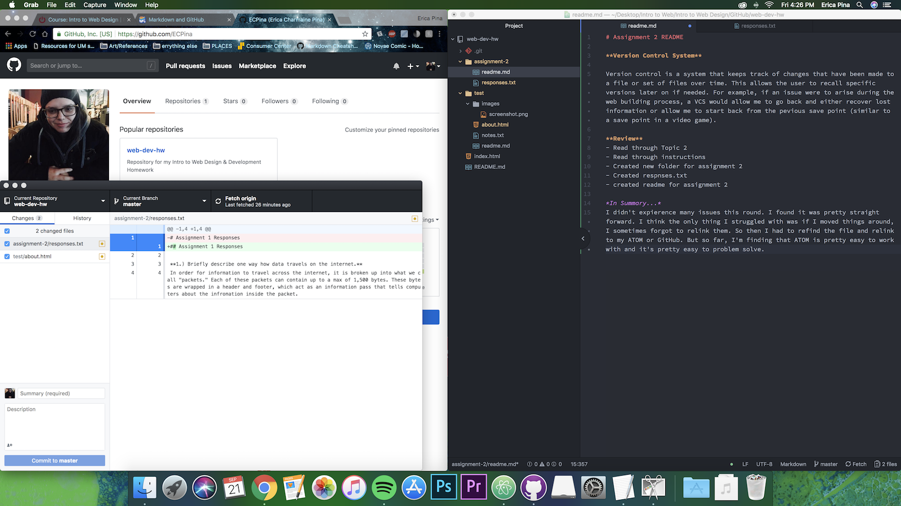

# Assignment 2 README

## Version Control System

Version control is a system that keeps track of changes that have been made to a file or set of files over time. This allows the user to recall specific versions later on if needed. For example, if an issue were to arise during the web building process, a VCS would allow me to go back and either recover lost information or allow me to start back from the pevious save point (similar to a save point in a video game).

**Review**
- Read through Topic 2
- Read through instructions
- Created new folder for assignment 2
- Created respnses.txt
- created readme for assignment 2

*In Summary...*

For some reason I'm constantly struggling with getting my images to appear on the readme on GitHub. Everytime, I forget how to link it and spend a lot of time freting over it. One day, I will remember the steps I've taken so that I don't tear my hair out over broken image links. Other than that, everything seemed pretty straightforward.

*Extra note: after looking at several examples, I realized I had a weirdspace in my image file. This just goes to show that it's important to double check how you name your files!*

[README](/assignment-2/readme.md)

## My Workstation:

