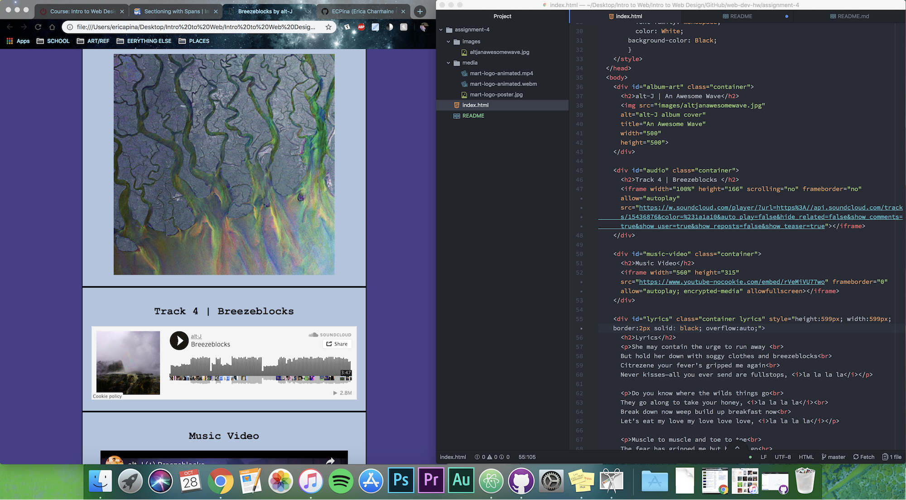

# README

## Divs, Classes, IDs, and Spans, Oh my!
Divs work as a container tag. This allows you to create a "block" where you can group together a set of elements. Spans, while similar to a div, is for more specific sets of text. A span allows you to modify specific text within a paragraph. An id attribute is placed within the header, and can then be later referenced within the body. It is unique and and allows and element to be identified differently from other elements. A class, while also working as an identifier, is used for a more general purpose. It allows you to identify several elements within your code.

## "Alt Text"
Alternative text, aka "Alt Text", describes the appearance and function of an image within your page. This is written within the HTML code and it will provide text for people who can't see images in their browsers.

## Work Cycle
I thought this week was pretty fun. I did struggle with the media arts clip and getting it to work properly and I'm honestly not sure how I fixed it in the end. I most likely misnamed something? Other than that, I had a lot of fun laying out this website.

## Screenshot

