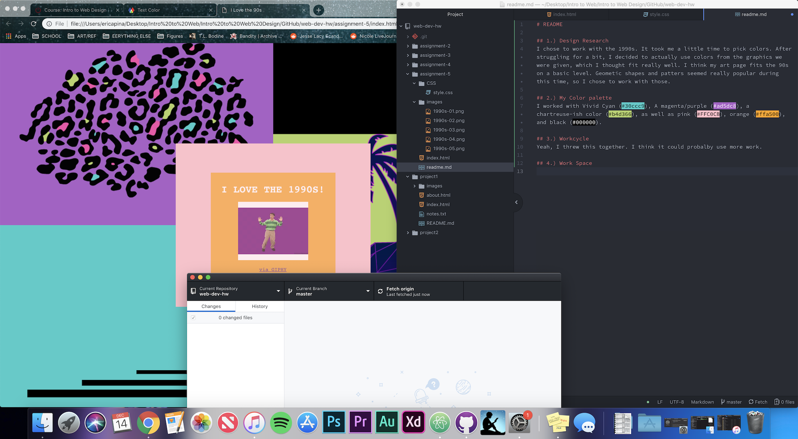

# README

## 1.) Design Research
I chose to work with the 1990s. It took me a little time to pick colors. After struggling for a bit, I decided to actually use colors from the graphics we were given, which I thought fit really well. I think my art page fits the 90s on a basic level. Geometic shapes and patters seemed really popular during this time, so I chose to work with those.

## 2.) My Color palette
I worked with Vivid Cyan (#30ccc9), A magenta/purple (#ad5dc8), a chartreuse-ish color (#b4d366), as well as pink (#FFC0CB), orange (#ffa500), and black (#000000).

## 3.) Workcycle
Yeah, I threw this together. I think it could probalby use more work.

## 4.) Work Space

