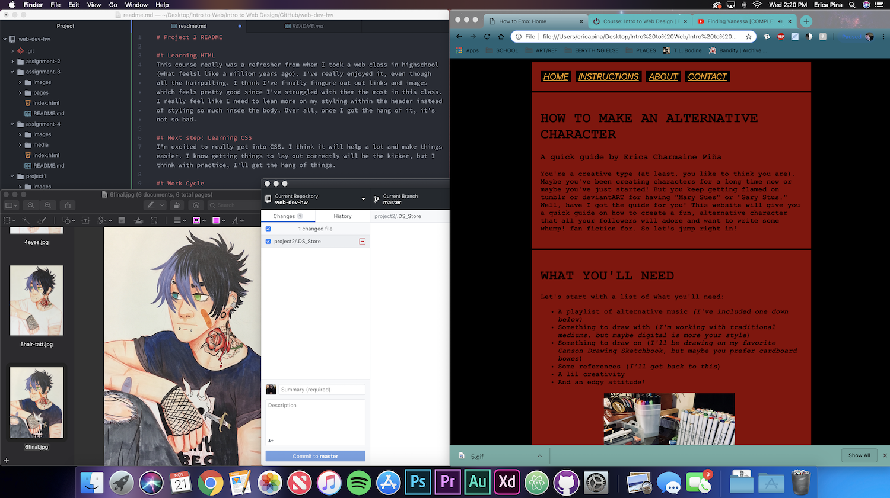

# Project 2 README

## Learning HTML
This course really was a refresher from when I took a web class in highschool (what feelsl like a million years ago). I've really enjoyed it, even though all the hairpulling. I think I've finally fingure out out links and images which feels pretty good since I've struggled with them the most in this class. I really feel like I need to lean more on my styling within the header instead of styling so much insde the body. Over all, once I got the hang of it, it's not so bad.

## Next step: Learning CSS
I'm excited to really get into CSS. I think it will help a lot and make things easier. I know getting things to lay out correctly will be the kicker, but I think with practice, I'll get the hang of things.

## Work Cycle
Honestly, I think I got a little to excited with my idea and kind of got lost part way though. I had a lot of fun and I'm excited to learn more indepth coding to help with page styling. I may have overkilled it with a few things as well, but hopefully it still looks pretty good.

 
